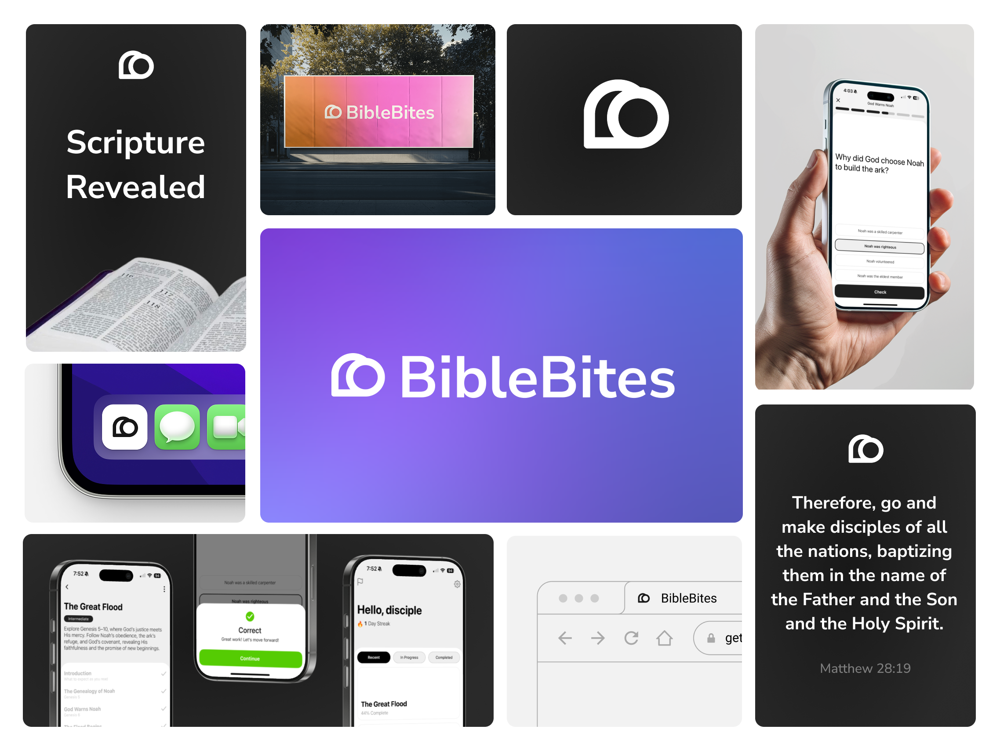
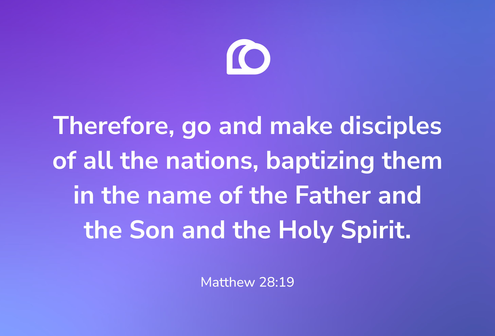
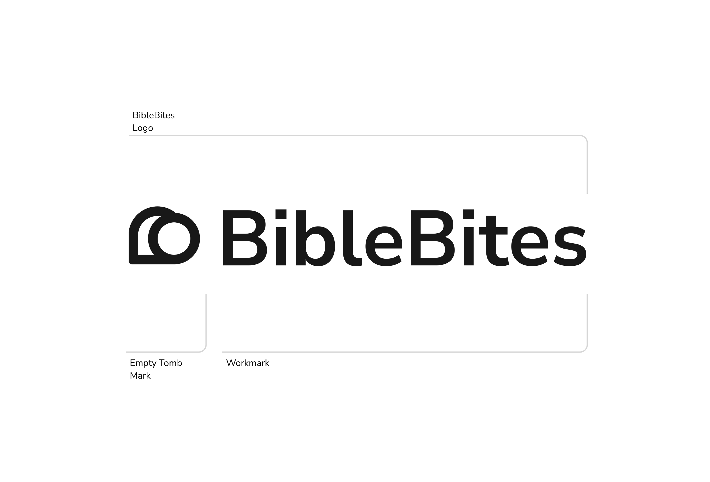
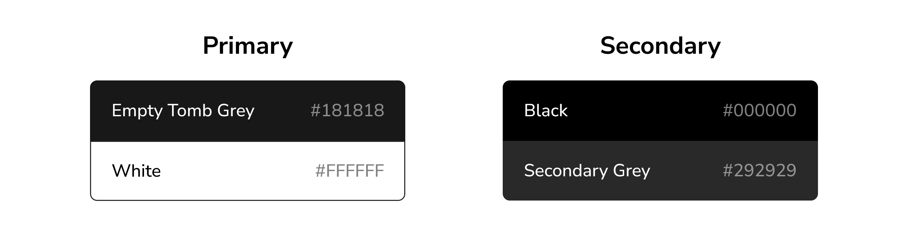

    <a href="https://getbiblebites.com/opensource">
        
        <h1 align="center">BibleBites Brand Kit</h1>
    </a>

Welcome to the official BibleBites brand kit. This guide includes everything you need to use our visual identity clearly and consistently — including our logo, color palette, and usage guidelines. It’s designed to help you represent BibleBites well while protecting the integrity of our brand, especially in public or promotional contexts.

 

## Table of Contents
 - [Introduction](#introduction)
 - [Logo](#logo)
 - [Colors](#colors)
 - [Legal & Usage](#legal--usage)

 

## Introduction
BibleBites is a Bible study app designed by Christians, for Christians. Our goal is to help you connect with God’s Word in a more accessible, flexible, and engaging way — no matter how busy life gets.

We believe the Bible is the divine Word of God — a unified story that points to Jesus. It’s the foundation of our faith and the lens through which we understand the world. Because of that, we believe everyone should have the opportunity to understand what it says. But we also know that not everyone has an hour for Bible study everyday. That’s why we created BibleBites — to make Bible study more accessible through small, focused lessons that fit into your everyday routine.

Our mission is to share God’s message with people around the world. Whether you’re new to the faith or have been following Jesus for decades — whether you’ve never picked up a Bible or have been studying it for years — BibleBites is here to equip and empower you to live out your faith and share it with others.

At the core of everything we do is a simple goal: to help more people know the Bible, live the Bible, and share the Bible — one bite at a time.

 

## Logo

### Empty Tomb Mark

At the center of the BibleBites brand is the **Empty Tomb Mark** — a simple, meaningful symbol inspired by the resurrection of Jesus. The mark represents the empty tomb, symbolizing new life, hope, and the truth found in the Gospel.

This mark is perfect for instances where the logo doesn’t need to be the focal point, but you still want to reinforce the BibleBites brand. It's ideal for smaller applications, icons, or anywhere the logo should act as a subtle, yet recognizable, symbol.

The mark should only be used after the full logo has already been presented, ensuring that the BibleBites brand is already established for recognition.

The Empty Tomb Mark is typically used in black or white, but can also be paired with gradients or placed over image backgrounds, as long as there’s enough contrast for clarity.

---

### Combined Logo

The full **BibleBites Logo** combines the Empty Tomb Mark and the wordmark into one complete visual identity. This version should be used when you want to showcase the full brand, especially in cases where the logo is the main visual element — such as websites, printed materials, or public-facing content.

Like the Empty Tomb Mark, the full logo can be placed over gradients or background images, provided the contrast is strong enough to keep it clear and readable.

 

## Colors

### Primary & Secondary Palette
Our color palette is designed to be simple, modern, and timeless, with a focus on clarity and strong contrasts that reflect the core of BibleBites. Below are the primary and secondary colors that make up our brand’s visual identity:

 

## Legal & Usage
When using the BibleBites brand, it's important to respect our visual identity and maintain the integrity of our logo and other assets. The following guidelines outline the correct and incorrect ways to use our branding, as well as important legal considerations.

Public usage of the BibleBites logo is permitted, such as promoting BibleBites-related community events (like church events, Bible studies, or small groups), sharing content by creators, or user-generated content. However, in all cases, the logo should not imply any official partnership or endorsement without explicit written permission, and it must always adhere to the brand guidelines.

### Do's
- **Follow branding guidelines**: Ensure consistent use of logos, colors, and assets as outlined in this kit.
- **Maintain clear space**: Always keep space around the logo for visibility and legibility.

### Don'ts
- **Don't alter the logo**: Avoid changing the logo’s colors, proportions, or adding effects.
- **Don't imply partnership or endorsement**: Never use the logo to suggest a partnership or endorsement without explicit permission.
- **Don't use on low-contrast backgrounds**: Ensure the logo is clearly visible by using it on appropriate backgrounds.
- **Don't use in harmful contexts**: Do not use the logo in a way that could harm or misrepresent the BibleBites brand.

By using the BibleBites logo, you agree to adhere to these guidelines, and BibleBites reserves the right to request the removal of the logo or brand assets for any reason.

If you have any questions, please contact us at [hello@sellersew.com](mailto:hello@sellersew.com).
